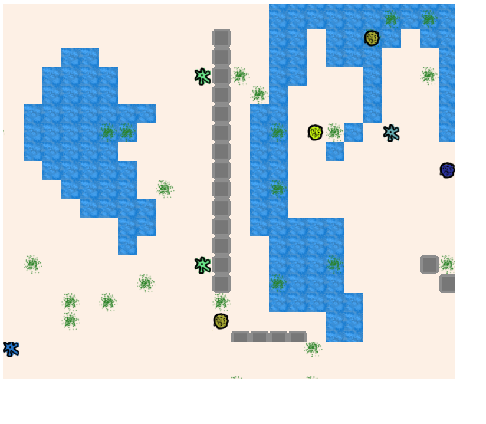

# Introducción

 Existe una creciente dificultad en el desarrollo de videojuegos, donde los jugadores esperan cada vez más, y cada vez en menos tiempo. Automatizar la generación del contenido surgió en los últimos años como una posible solución, pero encuentra la resistencia de los diseñadores y artistas, que necesitan mantener control sobre el comportamiento, las mecánicas del juego y la presentación visual. Como el contenido que se encuentra en un videjuego es múy amplio, este proyecto se centra en la generación de individuos que interactúan entre sí, dentro de un entorno definido por el desarrollador.

Este proyecto presenta un algoritmo novedoso para la generación de múltiples especies de organismos en entornos virtuales, cuyos comportamientos se encuentren interrelacionados, diseñado para ser aplicable en la industria de los videojuegos. 

El algoritmo propuesto, abreviado AGIO por su sigla en ingles, se basa en el algoritmo de neuroevolución NEAT. AGIO contempla la exploración de diversas especies, el control a nivel de diseño del comportamiento de los organismos y la interrelación de los comportamientos entre especies. Junto a la descripción del algoritmo, se realizó una implementación en C++ para evaluar la propuesta. Los resultados experimentales demostraron que AGIO es capaz de generar decenas de especies de organismos distintas y cadenas de dependencias en el comportamiento de las especies encontradas. Además, el desempeño conseguido respecto a tiempo de ejecución y uso de memoria hace que AGIO sea aplicable en el desarrollo de videojuegos de alta calidad.