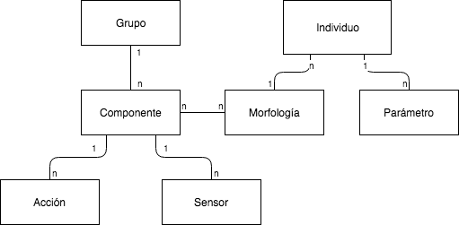

# Propuesta

AGIO genera especies de individuos y para cada individuo genera un comportamiento. Una especie se define como un conjunto de individuos que pueden cruzarse entre sí en el proceso evolutivo y que comparten una misma morfología. Cada especie tiene su propia población independiente de NEAT, por lo que en AGIO se están realizando _N_ procesos evolutivos independientes, donde _N_ es la cantidad de especies evolucionadas simultáneamente. 

 
  La estructura de los individuos, que se muestra en la imágen, permite a los diseñadores tener un control directo sobre como se pueden formar los individuos, que acciones pueden realizar y que información tienen del entorno. Adicionalmente, los parámetros de los indidividuos son valores numéricos que permíten mayor poder de expresión (un paramétro podría ser _fuerza_, asociado a una acción de atacar).

Cada individuo tiene su propia red neuronal que toma como entrada los valores de los sensores que ese individuo posee, y regresa como salida la probabilidad de realizar cada una de las acciones que el individuo puede realizar. La acción a realizar por el individuo es elegida aleatoriamente, siguiendo la distribución de probabilidad determinada por la red.