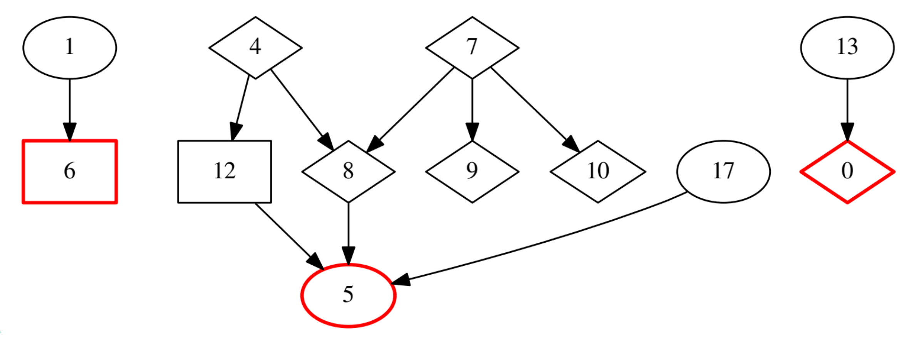
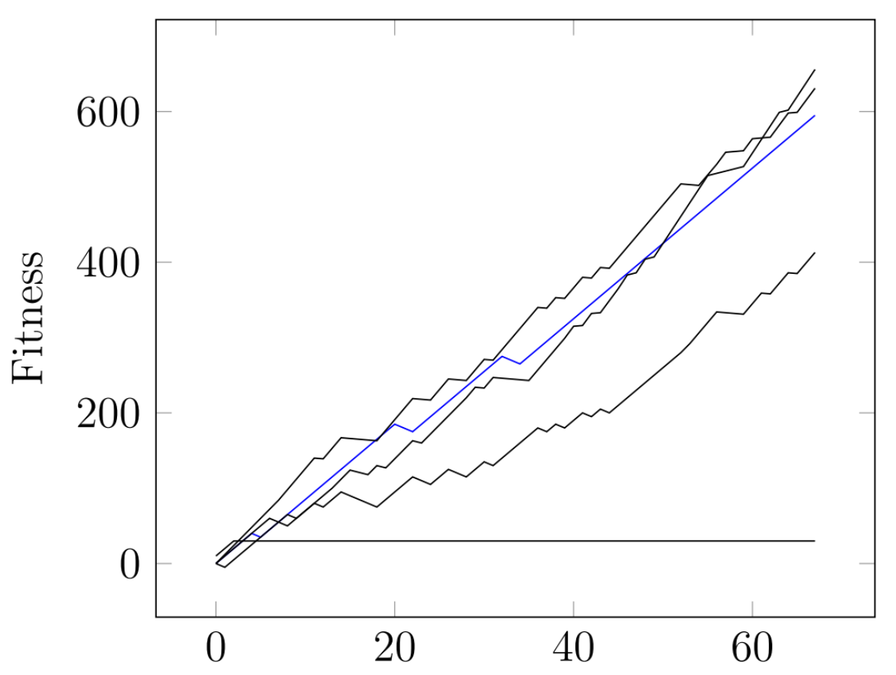

# Resultados
Se realizaron diversos experimentos para medir el desepeño del algoritmo. A continuación se muestran brevemente los resultados obtenidos en algúnos de ellos.

## Carnívoros y Herbívoros
El siguiente video muestra una simulación de individuos carnívoros, en rojo, y herbívoros, en verde claro, evolucionados con AGIO. Las manchas verdes distribuidas en el entorno corresponden a comida de la que se pueden alimentar los herbívoros. Como se puede ver, los comportamientos son diversos y acordes al problema, donde los carnívoros cazan a los herbívoros, y los herbívoros se alimentan de la comida del entorno. Por simplicidad, los individuos solo tienen los sensores a la comida más cercana, por lo que no pueden saber donde se encuentran los demás, por ejemplo, los herbívoros tienen la información para poder escapar de los carnívoros.

<iframe width="560" height="315" src="https://www.youtube.com/embed/xPl5bAr2WiA" frameborder="0" allow="accelerometer; autoplay; encrypted-media; gyroscope; picture-in-picture" allowfullscreen></iframe>

## Interrelaciones entre especies
Para medír que tan relacionadas se encuentran las especies encontradas por AGIO en un escenario en particular, se realizaron varias simulaciónes para obtener la medía y desviación de la distribución de fitness de cada especie (que resulta seguir una distribución normal), y luego se realizan varias simulación, retirando de la simución una de las especies y dejando las demás. Si alguna especie se encuentra realacionada con la que fue retirada, su fitness tiene que verse afectado significativamente. 

El grafo siguiente muestra las relaciones encontradas entre las diversas especies. Los rombos representan omnívoros, las elípses herbívoros y los cuadrados carnívoros. En rojo se marcan las especies que fallaron en evolucionar (su fitness fue siempre 0). La dirección de la flecha se interpreta de la siguiente manera : Si A → B, entonces el fitness de A decrece cuando B es retirada de la simulación.

Se encontraron 10 relaciónes entre especies para el escenario analizado, junto con cadenas de dependencias, como la formadas entre la especie 4, 8 y 5, por ejemplo. 

## AGIO vs Jugador
Como AGIO está enfocado al ámbito de los videojuegos, es crucial saber que tan adecuados son los comportamientos de los individuos cuando se introduce un jugador humano. Para esto se elige al azar un individuo de una de de las especies evolucionadas, y se le da el control del individuo al jugador, para que decida que acción realizar en cada paso. Al jugador se le muestran los valores de los sensores, y tiene que en base a eso elegir que acción realizar.

La siguiente gráfica muestra el fitness de los individuos de la especie del controlado por el jugador en negro, y el fitness del controlado por el jugador en azul. Como se puede ver, el comportamiento de los individuos evolucionados por AGIO es comparable al del jugador, e incluso AGIO logra superar al jugador en las partes finales de la simulación

